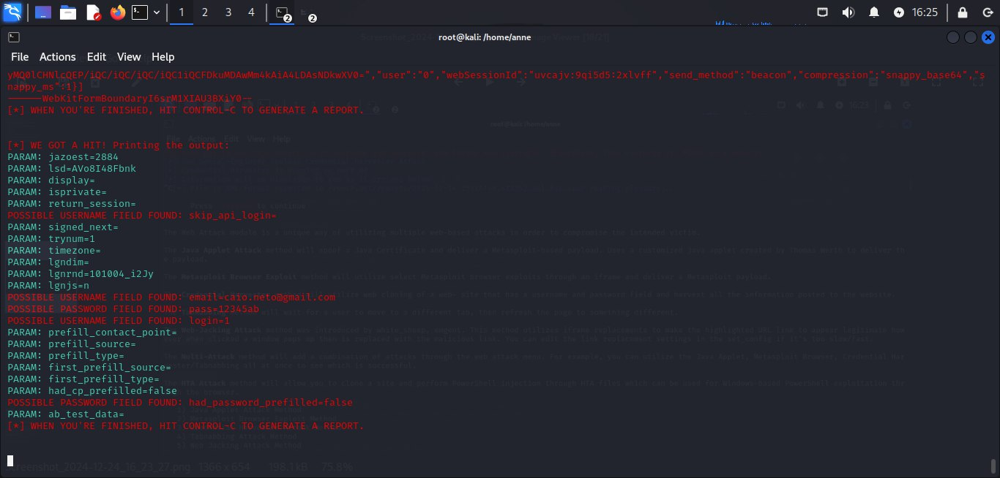
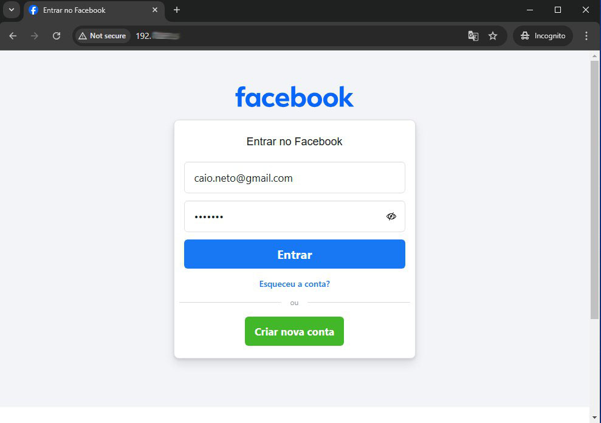

# Criação de um ataque Phishing para captura de senhas do Facebook

### Ferramentas Utilizadas

- Kali Linux
- setoolkit

### Configurando o Phishing no Kali Linux

- Acesso root: ``` sudo su ``` e digite a senha do Linux
- Iniciando o setoolkit: Digite ``` setoolkit ```
- Em "tipo de ataque:" Escolha a opção 1 ``` Social-Engineering Attacks ```
- Em "vetor de ataque:" Escolha a opção 2 ``` Web Site Attack Vectors ``` 
- Em "Método de ataque:" Escolha a opção 3 ```Credential Harvester Attack Method ``` 
- Novamente em "Método de ataque:" Escolha a opção 2 ``` Site Cloner ```
- Obtendo o endereço da máquina: ``` ifconfig ``` 
- Digite a URL para clone (não itilize o https): http://www.facebook.com

### Observações Importantes

- Ao testar a página que está sendo clonada, ao inserir login e senha na aba anônima do navegador, nem sempre ocorre um glitch. Em algumas ocasiões, somente uma página em branco é apresentada.
- No terminal, nem sempre as opções de "Copy selection" e afins estarão funcionando, exigindo do usuário a adição das informações manualmente.

### Resultados




